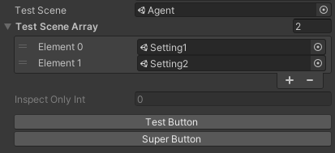

# Core of Smart Assistant

## What does this package contains??

This package is where all the utility functions as well as all the custom inspector drawer code lives.

## Custom Propery Attribute

### A simple example:
```cs
using UnityEngine;
using Voxell.Core.Inspector;

public class CustomInspectorTest : MonoBehaviour
{
  [Scene]
  public string testScene;
  [Scene]
  public string[] testSceneArray;
  [InspectOnly]
  public int inspectOnlyInt;

  [Button]
  void TestButton() => Debug.Log("TestButton function invoked!");
  [Button("Super Button")]
  void AnotherTestButton() => Debug.Log("Button with Super Button name pressed!");
}
```



## Utilities

### A simple example for MathUtil:

```cs
using Voxell;

Vector3 vec1 = new Vector3(0.1f, 0.5f, 0.9f);
Vector3 vec2 = new Vector3(2.0, 0.1f, 1.0f);
Vector3 maxVec = MathUtil.VectorMathOperation(vec1, vec2, Mathf.Max);

```
### Under the hood:

```cs
maxVec.x = Mathf.Max(vec1.x, vec2.x);
maxVec.y = Mathf.Max(vec1.y, vec2.y);
maxVec.z = Mathf.Max(vec1.z, vec2.z);
```

## Logging

### A simple example:
```cs
using Voxell;

public class LoggingTest : MonoBehaviour
{
  public Logging logger;

  public void NormalLog() => logger.ConditionalLog("NormalLog", LogImportance.Info, LogStyle.Log);
  public void ImportantLog() => logger.ConditionalLog("ImportantLog", LogImportance.Important, LogStyle.Log);
  public void CrucialWarning() => logger.ConditionalLog("CrucialWarning", LogImportance.Crucial, LogStyle.Warning);
  public void CriticalError() => logger.ConditionalLog("CriticalError", LogImportance.Critical, LogStyle.Error);
}
```

## How to use?

This package requires the Unity.Mathematics package in order to work.

1. Install Unity's Mathematics from the Package Manager.
2. Clone this repository into your project's Packages folder.
3. And you are ready to go!

## Support the project!

<a href="https://www.patreon.com/voxelltech" target="_blank">
  
</a>

<a href ="https://ko-fi.com/voxelltech" target="_blank">
  
</a>

## License

Smart Assistant as a whole is licensed under the GNU Public License, Version 3. Individual files may have a different, but compatible license.

See [license file](./LICENSE) for details.